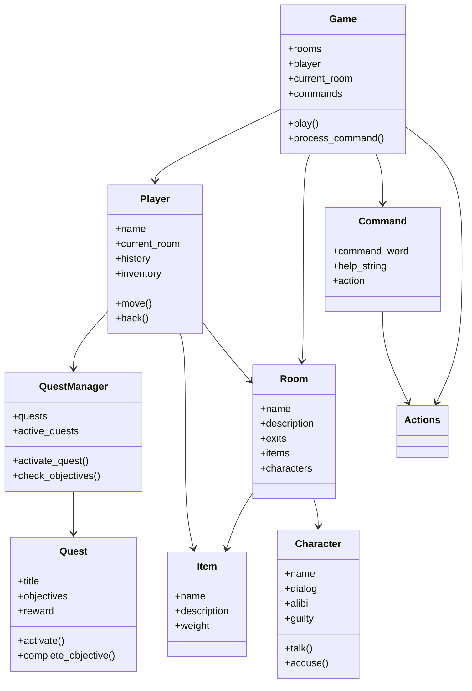

# TBA

##  Organisation du projet et description des modules

Le projet est structuré en plusieurs modules Python, chacun ayant une responsabilité bien définie afin de garantir une architecture claire, modulaire et maintenable.

###  Modules principaux

- `game.py` / `Game` :  
  Gère la boucle principale du jeu, l’initialisation de l’environnement, la gestion des entrées utilisateur ainsi que la coordination entre les différents modules.

- `room.py` / `Room` :  
  Définit les propriétés génériques d’un lieu, notamment son nom, sa description, les sorties disponibles, les objets présents et les personnages rencontrés.

- `player.py` / `Player` :  
  Représente le joueur, sa position dans le monde, son historique de déplacements, son inventaire et ses interactions avec l’environnement.

- `command.py` / `Command` :  
  Représente les commandes saisies par le joueur, leur analyse syntaxique ainsi que leur interprétation.

- `actions.py` / `Action` :  
  Centralise l’ensemble des actions réalisables dans le jeu (déplacements, observation, dialogues, accusations, gestion des quêtes, etc.) et assure le lien entre les commandes et la logique métier.

---

###  Modules secondaires

- `character.py` / `Character` :  
  Gère les personnages non-joueurs, leurs dialogues, leurs alibis, leur comportement et leur implication dans l’enquête.

- `item.py` / `Item` :  
  Définit les objets interactifs du jeu, leurs propriétés et leur rôle dans la résolution des quêtes et de l’enquête.

- `quest.py` / `Quest` :  
  Représente une quête, ses objectifs, sa progression et sa récompense.

- `quest_manager.py` / `QuestManager` :  
  Assure la gestion centralisée des quêtes, notamment leur activation, leur suivi et la validation des objectifs.

---

#  Guide Utilisateur

---

##  Présentation générale

Ce projet est un jeu d’aventure textuel (Text-Based Adventure – TBA) développé en Python.  
Le joueur incarne un détective chargé de résoudre une enquête criminelle au sein d’une bibliothèque universitaire.

L’objectif est d’explorer les différentes salles, d’interagir avec les personnages, de collecter des indices, d’accomplir des quêtes et, à terme, de démasquer le véritable coupable.

---

##  Univers du jeu

L’action se déroule dans une bibliothèque universitaire mystérieuse, composée de plusieurs salles thématiques.  
Un meurtre y a été commis, et plusieurs suspects sont présents sur les lieux.

Le joueur devra :
- explorer les différents espaces,
- analyser les dialogues,
- confronter les alibis,
- et relier les indices afin de résoudre l’enquête.

---

##  Conditions de victoire et de défaite

### Conditions de victoire

- Identifier correctement le coupable.
- L’accuser via la commande appropriée.

### Conditions de défaite

- Accuser un innocent.
- Quitter le jeu sans avoir résolu l’enquête.

---

##  Carte et exploration

Le jeu propose une exploration libre de plusieurs salles interconnectées.

### Exemples de salles :

- Bibliothèque principale  
- Salle d’Histoire  
- Salle de Philosophie  
- Salle de Psychologie  
- Salle de Technologie  
- Salle de Mathématiques  

Chaque salle peut contenir :
- des personnages,
- des objets,
- des sorties vers d’autres salles.

---

##  Personnages

Le joueur peut interagir avec différents personnages, chacun possédant :
- un dialogue spécifique,
- un alibi,
- un rôle potentiel dans l’enquête.

Un seul de ces personnages est le véritable coupable.

---

##  Objets et indices

Des objets sont disséminés dans le jeu et servent d’indices clés pour progresser dans l’enquête.

Exemples :
- arme du crime,
- documents suspects,
- supports numériques,
- objets personnels.

---

##  Système de quêtes

Le jeu intègre un système de quêtes dynamiques permettant de guider le joueur.

Chaque quête comporte :
- des objectifs précis,
- une progression mesurable,
- une récompense.

Les quêtes permettent de :
- structurer l’exploration,
- encourager les interactions,
- faciliter la progression narrative.

---

##  Installation

### Prérequis

- Python 3.9 ou supérieur
- Tkinter (inclus par défaut avec Python)

---
##  Diagramme Mermaid

---

##  Perspectives de développement

Plusieurs axes d’amélioration ont été identifiés afin d’enrichir l’expérience de jeu et d’améliorer la qualité globale du projet :

###  Interface graphique
L’interface graphique a été partiellement développée. Cependant, en raison de nombreux problèmes techniques impactant le code de base, nous avons décidé de suspendre temporairement son développement afin de garantir la stabilité du jeu.

Dans une perspective future, nous souhaitons :
- résoudre ces problèmes structurels,
- optimiser l’architecture du projet,
- et proposer aux utilisateurs une véritable interface graphique complète, fluide et ergonomique, améliorant significativement l’immersion.

---

###  Carte du jeu et level design
Nous souhaitons proposer une carte plus élaborée et immersive, intégrant une verticalité (étages, sous-sols, escaliers, ascenseurs, etc.).  
Cette évolution permettrait :
- d’enrichir l’exploration,
- de complexifier les déplacements,
- et d’augmenter la profondeur du gameplay, améliorant ainsi le plaisir de jeu.

---

###  Quêtes secondaires et progression
Concernant les quêtes secondaires, nous aurions souhaité créer un véritable lien de dépendance entre elles, en mettant en place un système de récompenses influençant directement leur faisabilité.

Par exemple :
- certaines quêtes ne pourraient être accessibles qu’après l’obtention d’objets ou de compétences spécifiques,
- les récompenses pourraient débloquer de nouvelles zones, interactions ou dialogues.

Cela permettrait de renforcer la cohérence scénaristique, la progression du joueur et la dimension stratégique du jeu.

