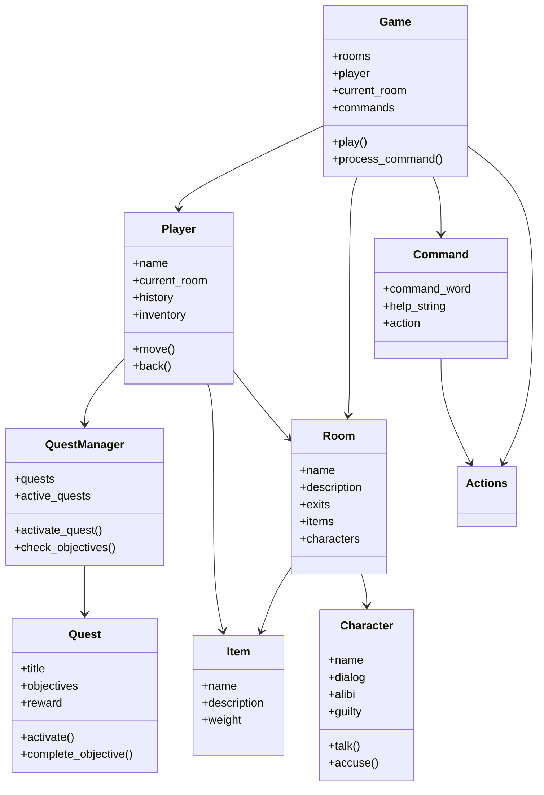

# TBA

Ce repo contient la première version (minimale) du jeu d’aventure TBA.

Les lieux sont au nombre de 6. Il n'y a pas encore d’objets ni de personnages autres que le joueur et très peu d’interactions. Cette première version sert de base à ce qui va suivre, et sera améliorée au fur et à mesure.


## Structuration

Il y a pour le moment 5 modules contenant chacun une classe.

- `game.py` / `Game` : description de l'environnement, interface avec le joueur ;
- `room.py` / `Room` : propriétés génériques d'un lieu  ;
- `player.py` / `Player` : le joueur ;
- `command.py` / `Command` : les consignes données par le joueur ;
- `actions.py` / `Action` : les interactions entre .


# 🕵️ TBA – Text Based Adventure : Enquête à la Bibliothèque

Un **jeu d'aventure textuel (Text-Based Adventure)** développé en **Python**, proposant une **enquête immersive** dans une bibliothèque mystérieuse.  
Le joueur doit explorer les salles, interroger les suspects, collecter des indices et résoudre un meurtre.


---

## Objectif du jeu

Nous sommes en **1999**, dans la bibliothèque Hogward.  
Un meurtre vient d’être commis. À vous de :

- Explorer les différentes salles 
- Interroger les suspects
- Récolter des indices
- Remplir des quêtes
- Trouver le coupable et résoudre l'enquête

---

## Structure du projet

 project/
│
├── game.py → Moteur principal + interface graphique
├── actions.py → Gestion des commandes du joueur
├── command.py → Classe Command
├── player.py → Classe Player
├── room.py → Gestion des salles
├── character.py → Gestion des personnages (PNJ)
├── item.py → Gestion des objets
├── quest.py → Système de quêtes + gestionnaire
├── assets/ → Images pour l’interface graphique
└── README.md → Documentation du projet

---


### Vérification de Tkinter

```bash
python -m tkinter
▶️ Lancer le jeu
Mode graphique (par défaut)
bash
Copier le code
python game.py
Mode console (terminal)
bash
Copier le code
python game.py --cli
🎮 Commandes disponibles
Commande	Description
help	Affiche l’aide
go <N/E/S/O>	Se déplacer
look	Observer la salle
back	Revenir à la salle précédente
history	Voir l’historique
talk <nom>	Parler à un suspect
alibi <nom>	Demander l’alibi
accuse <nom>	Accuser un suspect
quests	Voir les quêtes
quest <nom>	Détails d'une quête
activate <nom>	Activer une quête
rewards	Voir les récompenses
quit	Quitter le jeu

🗺️ Salles disponibles
Bibliothèque (hall principal)

Salle Histoire

Histoire contemporaine

Politique

Société

Environnement

Philosophie

Psychologie

Technologie

Mathématiques

🧑‍🤝‍🧑 Personnages (PNJ)
Bibliothécaire

Étudiant

Professeur

Chercheuse

Agent de sécurité

Un seul est coupable — à vous de le découvrir 🔍

🗃️ Objets & Indices
Arme du crime 🗡️

Livre ancien 📖

Clé USB 💾

Ordinateur 💻

Les objets permettent d’enrichir l’enquête.

🗺️ Système de quêtes
Le jeu intègre un système complet de quêtes dynamiques.

Exemples de quêtes :
Explorer les salles liées à l'humain

Interroger tous les suspects

Chaque quête possède :

des objectifs

une progression

une récompense

🖥️ Interface graphique (GUI)
Le jeu propose une interface Tkinter avec :

Zone d’image dynamique 🖼️

Terminal interactif 🖥️

Boutons de déplacement 🎮

Boutons d’aide et quitter





##  Perspectives de développement

Plusieurs axes d’amélioration ont été identifiés afin d’enrichir l’expérience de jeu et d’améliorer la qualité globale du projet :

###  Interface graphique
L’interface graphique a été partiellement développée. Cependant, en raison de nombreux problèmes techniques impactant le code de base, nous avons décidé de suspendre temporairement son développement afin de garantir la stabilité du jeu.

Dans une perspective future, nous souhaitons :
- résoudre ces problèmes structurels,
- optimiser l’architecture du projet,
- et proposer aux utilisateurs une véritable interface graphique complète, fluide et ergonomique, améliorant significativement l’immersion.

---

###  Carte du jeu et level design
Nous souhaitons proposer une carte plus élaborée et immersive, intégrant une verticalité (étages, sous-sols, escaliers, ascenseurs, etc.).  
Cette évolution permettrait :
- d’enrichir l’exploration,
- de complexifier les déplacements,
- et d’augmenter la profondeur du gameplay, améliorant ainsi le plaisir de jeu.

---

###  Quêtes secondaires et progression
Concernant les quêtes secondaires, nous aurions souhaité créer un véritable lien de dépendance entre elles, en mettant en place un système de récompenses influençant directement leur faisabilité.

Par exemple :
- certaines quêtes ne pourraient être accessibles qu’après l’obtention d’objets ou de compétences spécifiques,
- les récompenses pourraient débloquer de nouvelles zones, interactions ou dialogues.

Cela permettrait de renforcer la cohérence scénaristique, la progression du joueur et la dimension stratégique du jeu.

